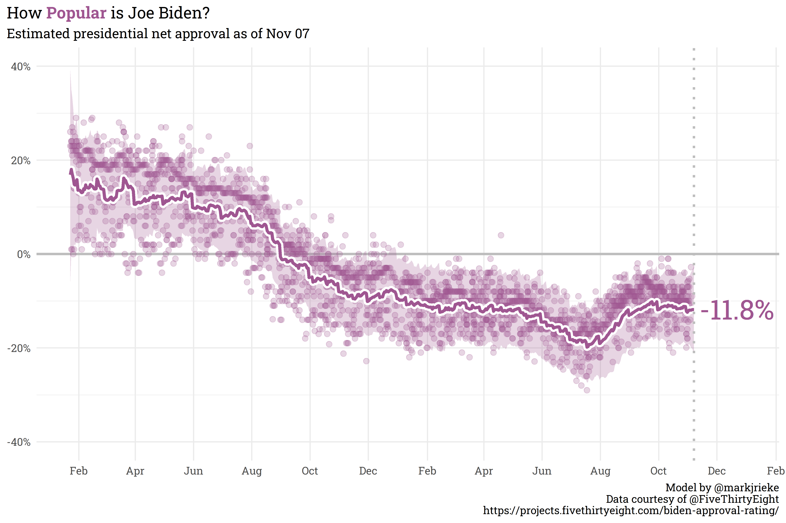

## 2022 Midterm Forecast

Landing page for the 2022 midterm forecast, updated intermittently.
Running the script
[`update_readme.R`](https://github.com/markjrieke/2022-midterm-forecasts/blob/main/scripts/update_readme.R)
will update all the plots below to the current day.

### Generic Ballot Average

To generate the current generic congressional ballot average, you can
run the script
[`generic_ballot_weighting.R`](https://github.com/markjrieke/2022-midterm-forecasts/blob/main/scripts/model_train/generic_ballot_weighting.R).
You can read about how this model was built and explore some of the
results from training
[here](https://www.thedatadiary.net/blog/2021-12-14-do-voters-want-democrats-or-republicans-in-congress/).

### Presidential Approval Average

To generate the plots below, you can run the script
[`approval_trends_weighting.R`](https://github.com/markjrieke/2022-midterm-forecasts/blob/main/scripts/model_train/approval_trends_weighting.R).
You can read about how this model was built and explore some of the
results from training
[here](https://www.thedatadiary.net/blog/2022-01-26-how-popular-is-joe-biden/).

