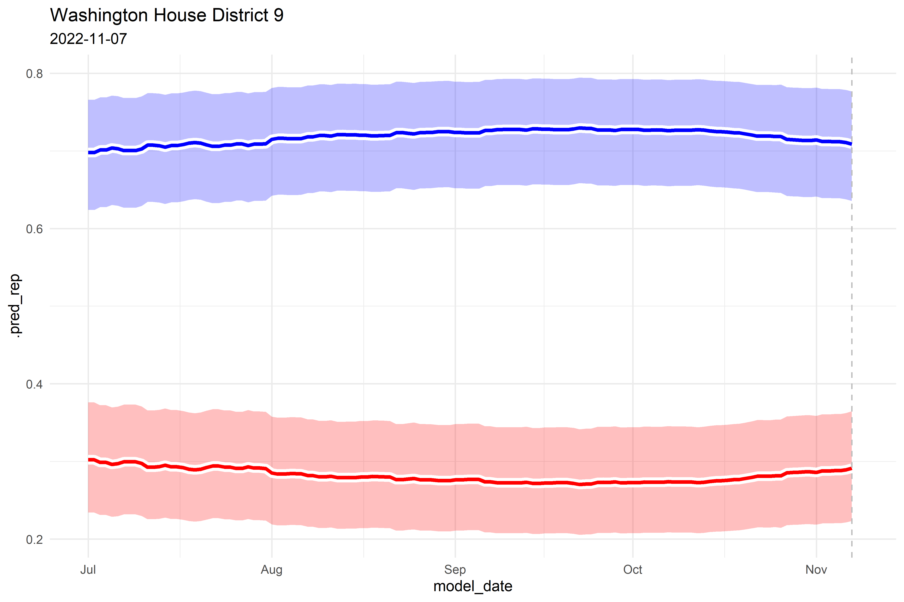

# README

For the full forecast, please see the following links:

-   [Senate](https://www.thedatadiary.net/senate/)
-   [House](https://www.thedatadiary.net/house/)
-   [Governor](https://www.thedatadiary.net/governor/)

# Model Updates

## punk november 2.1

###### 9-14-22

-   Updated candidate roster post-primary

## punk november 2.0

###### 9-7-22

-   Updated poll model to scale loess span relative to days out from
    election:
    -   `last_poll` \> 100 days -\> `span = 1`
    -   `last_poll` \<= 100 days -\>
        `span = 0.25 * (last_poll/100) + 0.75`
-   Updated all historical data as well.

## punk november 1.0

###### 9-5-22

-   Initial release

# House

# Senate

# Random Race

# Training Diagnostics

## Pre-fit EDA

## Post-fit EDA

