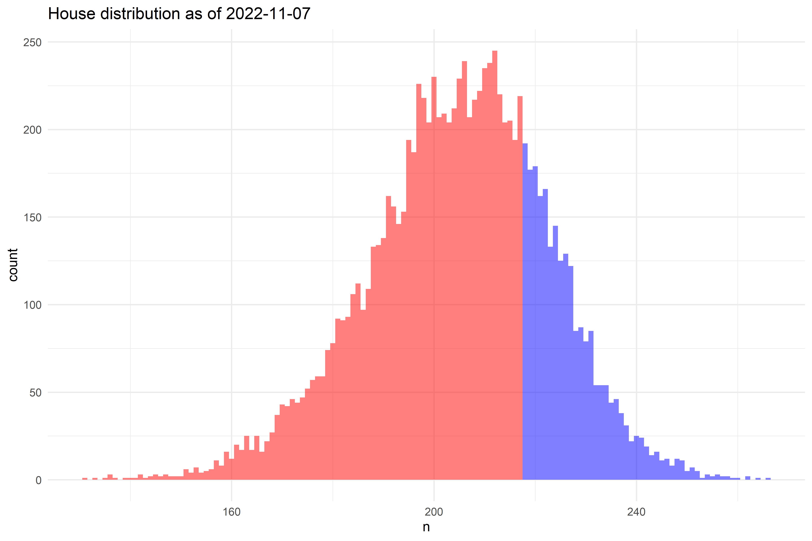
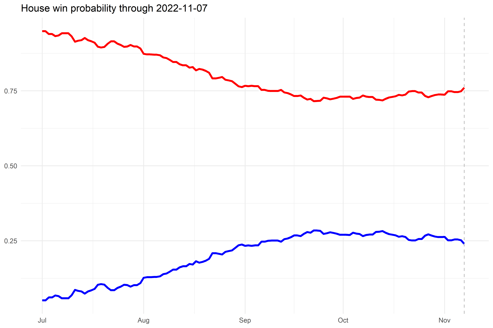
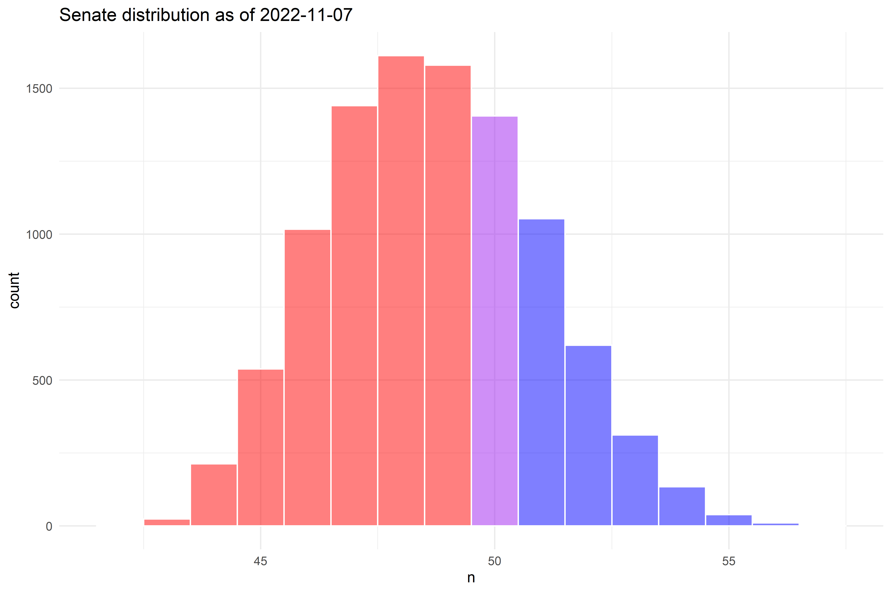

# README

For the full forecast, please see the following links:

-   [Senate](https://www.thedatadiary.net/senate/)
-   [House](https://www.thedatadiary.net/house/)
-   [Governor](https://www.thedatadiary.net/governor/)

# Model Updates

## punk november 2.0

###### 9-7-22

-   Updated poll model to scale loess span relative to days out from
    election
-   Updated all historical data as well

## punk november 1.0

###### 9-5-22

-   Initial release

# House

# Senate

